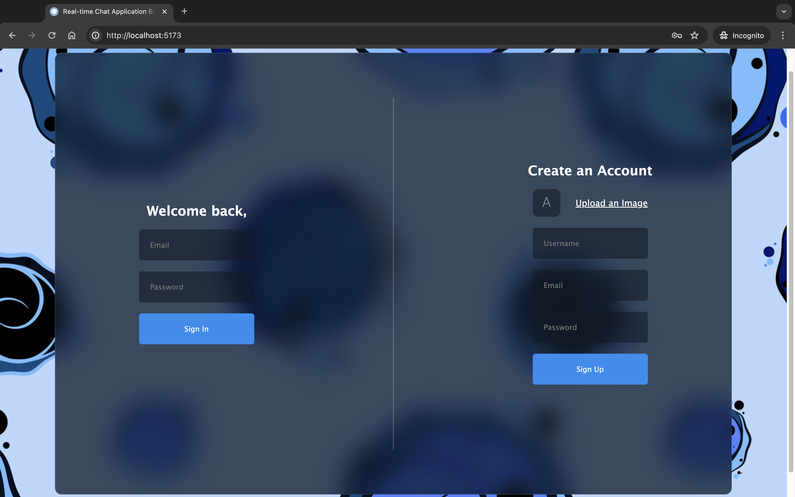
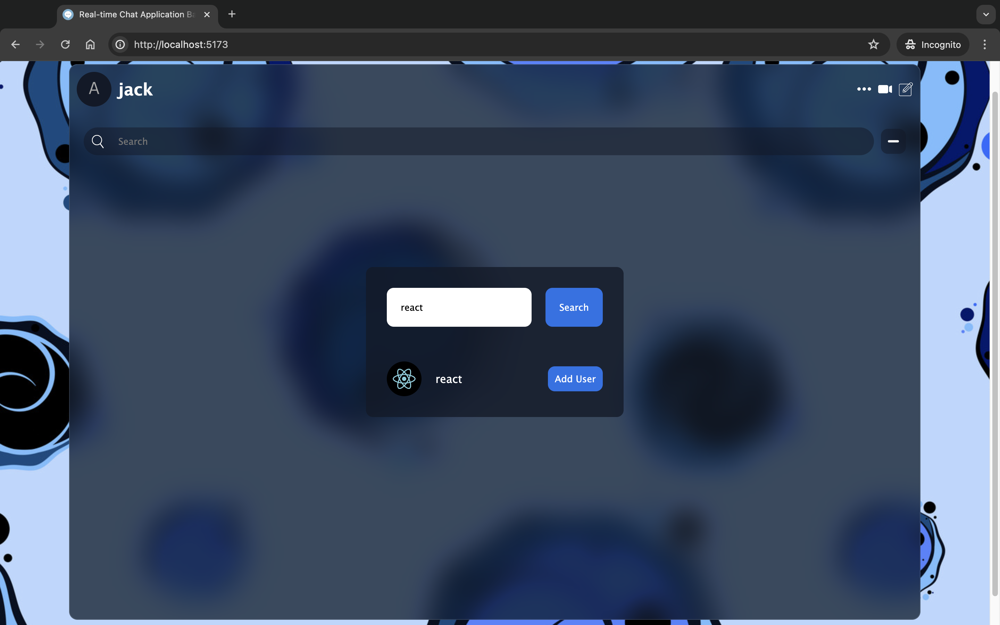
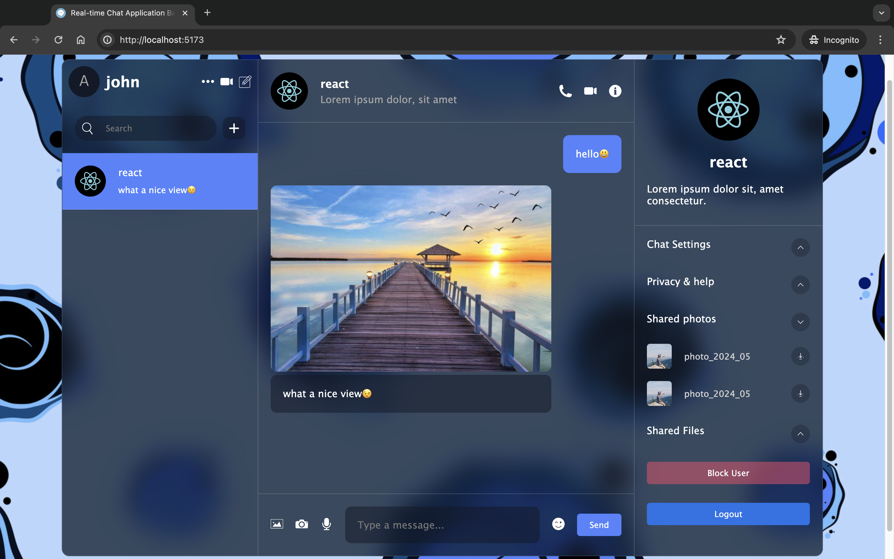

# Real-time Chat Application Based on React and Firebase

This project is a real-time chat application built using React and Firebase. It provides features such as user registration, login, real-time messaging, user search, chat history search, image uploading, and user blocking/unblocking.

## Features

- User registration and login using email and password
- Real-time messaging with instant message delivery and reception
- User and chat history search functionality
- Image uploading for enhanced user experience
- User blocking and unblocking capabilities

## Technologies Used

- React: A JavaScript library for building user interfaces
- Firebase: A backend platform for building web and mobile applications
  - Firebase Authentication: User authentication using email and password
  - Firestore: Real-time database for storing chat messages and user data
  - Firebase Storage: Storage service for user-uploaded images
- Zustand: A state management library for React applications
- React Emoji Picker: A library for adding emoji picker functionality
- React Toastify: A notification library for React applications

## Demo

Here are some screenshots showcasing the chat application:

*Login and sign up screen with email and password authentication*

  

*User search result*

  

*Chat list displaying user conversations*

  

## YouTube Tutorial

This project was developed by following a tutorial on YouTube. You can find the tutorial video here: [Link to YouTube Tutorial](https://www.youtube.com/watch?v=domt_Sx-wTY&t=5113s)

## Getting Started

To run this project locally, follow these steps:

1. Clone the repository: `git clone https://github.com/lost-komorebi/react-firebase-chat.git`
2. Install the dependencies: `npm install`
3. Set up a Firebase project and configure the necessary credentials into `.env` file
4. Start the development server: `npm start`
5. Open the application in your browser at `http://localhost:5173`

## Contributing

Contributions are welcome! If you find any bugs or have suggestions for improvements, please open an issue or submit a pull request.
